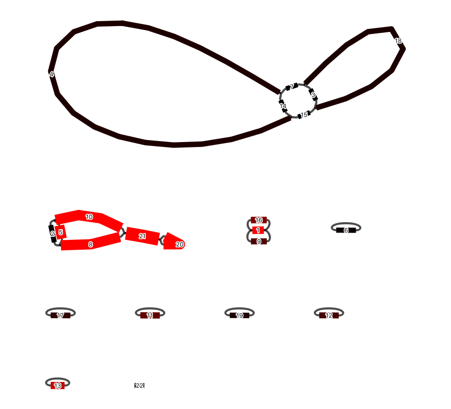

## Example datasets

These example GFA files have been generated from <a href="https://github.com/maickrau/MBG">MBG</a> on readsets generated by the Darwin Tree of Life project.

We will go through an example or two of how `gfatk` can be used to interrogate a GFA file and find out some interesting things, including getting a linearised assembly. We will be using the latest version of `gfatk`, version 0.2.14. Grab a copy, either using the releases, or compile yourself.

```bash
# latest release from crates.io
cargo install gfatk
```

### The Tree of Heaven

*Ailanthus altissima*, whilst not a native plant to Britain and Ireland, has made its way into the DToL datasets. It is a reasonably common weedy tree, at least in the south of England, and is planted widely. MBG (with parameters k = 5001, a = 5, w = 250, and u = 150), was able to produce an assembly GFA. Let's take a look at it.



This is a nice bandage plot which shows also relative coverage as the colours (low = black, high = red). There are two bigger subgraphs, each with six nodes and one is at much higher coverage than the other. There's also some shrapnel, which we won't consider further. We fed MBG the raw reads, and because of the parameters we used, we have assembled those structures which are at higher coverage than the nuclear genome. So we suspect that the mitochondrial genome and the chloroplast genome are present in this GFA.

Firstly, we can take a look at some statistics from the GFA file. `gfatk stats` can be used for this.

```bash
# run gfatk stats with the tabular output option.
gfatk stats -t ./drAilAlti1_k=5001a=5w=250u=150.gfa
```

And the output of this command is below:

| subgraph_index | gc         | node_count | edge_count | coverage  | segments       | total_seq_len | is_circular |
| -------------- | ---------- | ---------- | ---------- | --------- | -------------- | ------------- | ----------- |
| 2              | 0.43428758 | 6          | 16         | 242.35101 | 3,4,7,14,15,18 | 706976        | true        |
| 1              | 0.38155055 | 6          | 16         | 4610.6597 | 2,5,8,10,20,21 | 190041        | true        |
| 0              | 0.5853151  | 3          | 8          | 1091.1666 | 1,9,16         | 36609         | true        |
| 3              | 0.58213186 | 1          | 2          | 298.333   | 6              | 16577         | true        |
| 7              | 0.5867449  | 1          | 2          | 496.333   | 17             | 16537         | true        |
| 4              | 0.57701683 | 1          | 2          | 773.667   | 11             | 16412         | true        |
| 8              | 0.5879017  | 1          | 2          | 406       | 19             | 16399         | true        |
| 5              | 0.5853971  | 1          | 2          | 613.333   | 12             | 16394         | true        |
| 6              | 0.42857143 | 1          | 2          | 1333      | 13             | 11669         | true        |
| 9              | 0.5870257  | 1          | 0          | 236.5     | 22             | 8170          | false       |

The output is grouped by subgraph, as this is the natural unit in a GFA. The subgraphs are given an integer name starting from zero (this is arbitrary, but it's the order in which they were generated). I've ordered the TSV above by total sequence length, so we can see the largest subgraphs first. Not surprisingly, we see the top row is the statistical output of the largest graph in the bandage plot above. Two things to note are the GC% and the coverage. The GC% is ~0.43, and the coverage is ~242. Plant mitochondria generally have GC% in the range 0.41-0.5, and are of lower coverage than the chloroplast. We can use this information to extract the mitochondria from this larger GFA.

```bash
# extract the mitochondrion from the GFA.
gfatk extract-mito ./examples/drAilAlti1_k=5001a=5w=250u=150.gfa > ./drAilAlti1_k=5001a=5w=250u=150_extract_mito.gfa
# we can also check the stats directly from an extraction
# by piping the output to `gfatk stats`
gfatk extract-mito ./examples/drAilAlti1_k=5001a=5w=250u=150.gfa | gfatk stats -t
```

Under the hood, `gfatk extract-mito` uses `gfatk stats` to make a decision on which subgraph is a mitochondrion. Now that we have a putative mitochondrion, we can use `gfatk linear` to get a linearised assembly.

```bash
# `-e` is a flag to evaluate subgraphs (so if we had multiple subgraphs in the same file, the linearisation algorithm would be applied to every subgraph). Redundant in this case, but gives more info in the final fasta headers.
# `-i` includes node coverage in the linearisation algorithm. This means if some nodes were present at relative double coverage, the final path would try and include this node twice.
gfatk linear -e -i drAilAlti1_k=5001a=5w=250u=150_extract_mito.gfa > drAilAlti1_k=5001a=5w=250u=150_extract_mito.fa
```

You will note if you run this, that two lines will be printed to the STDERR.

```txt
[+]     Highest cumulative coverage path = 1142
[+]     Chosen path through graph: 4-,14-,4-,15+,18-,3+,18+,7-
```

If you follow that chosen path through the graph, each of the big loops get included twice, as their coverage (~400x) is roughly double that of the four smaller segments (~200x). Beautiful.

The whole pipeline can be run in a single line:

```bash
gfatk extract-mito ./examples/drAilAlti1_k=5001a=5w=250u=150.gfa | gfatk linear -e -i > drAilAlti1_k=5001a=5w=250u=150_extract_mito.fa
```