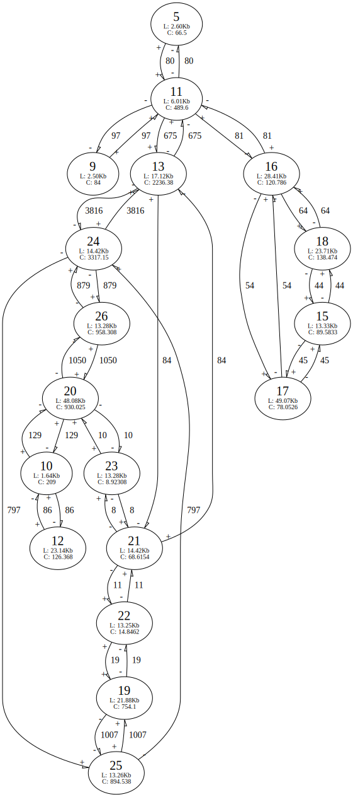
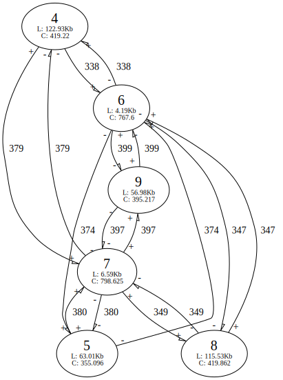

## Example datasets

These example GFA files have been generated from <a href="https://github.com/maickrau/MBG">MBG</a> on readsets generated by the Darwin Tree of Life project.

### Costard Apple mitochondrial genome

We will look at some stats first:

```bash
gfatk stats drMalDome11_5k.gfa
```

This is the output, containing some simple statistics about the graph. If there was more than one subgraph in the GFA, these would be separated out.

```
Subgraph 1:
        Number of nodes/segments: 3
        Number of edges/links: 8

        Segment ID's:
        4, 5, 6

        Total sequence length:  400966
        Total sequence overlap length:  55848
        Sequence length minus overlaps: 345118
        GC content of total sequence:   0.45705
        Average coverage of total segments:     275.845
Total number of subgraphs: 1
```

This looks mitochondria-ey, with a sequence length 300-400Kb and GC content ~45%. Let's plot it!

```bash
# install dot -> `conda install -c anaconda graphviz`
# graphviz is a *very* cool bit of software.
gfatk dot drMalDome5_11.gfa | dot -Tsvg > drMalDome5_11.svg
```

<p align="center">
  
</p>

Now that we're confident it's a mito, let's linearise the GFA. By default this is done by finding the longest path through the graph, visiting each node only once. It's like a hamiltonian path but with some constraints (orientation of segments matters).

```bash
# I am piping the output (which would be a fasta) into the void
# because I'm only interested in the stderr output
gfatk linear ./examples/drMalDome11_5k.gfa > /dev/null
```

MBG kindly outputs the coverage of the edges between the graph segments (see the graph above) for us, so we can see which paths have more coverage, and take these into account when linearising (in this case the edge coverages were not that informative). We can see the output generated a path of length three (phew), which is how many segments there were in the graph.

```
[+]     Highest cumulative coverage path = 426
[+]     Chosen path through graph: - 6 -> - 5 -> + 4
```

We can include the `-i` flag, to force `gfatk` to take into account the coverage of the *segments* (in contrast to the edge coverages above). In this case, looking at the graph above we can see that segment 5 occurs at about double the coverage of the other segments:

```bash
# pass the `-i` flag
gfatk linear -i ./examples/drMalDome11_5k.gfa > /dev/null
```

Shows this:

```
[+]     Highest cumulative coverage path = 661
[+]     Chosen path through graph: - 5 -> + 4 -> + 5 -> + 6
```

We've included more edges, so the total edge coverage goes up, and we have added segment 5 twice. A note here that if there is a large variance in coverage between nodes, the number of possible paths to explore in graph space explodes. In this case, you'll get a stack overflow and `gfatk` will be broken.

### Meadowsweet mitochondrial genome

This example is more complex than above, as can be seen from the graph.

```bash
gfatk dot ./filipendula_ulmaria_Jan.21.22-10_mito.gfa | dot -Tsvg > ./filipendula_ulmaria_Jan.21.22-10_mito.svg
```

<p align="center">
  
</p>

`gfatk` will find the longest path to linearise through the graph. `gfatk` will exclude illegal paths, for example an path including `23 -> 20 -> 10`. This is because `23` is connected to `20` by a positive - positive edge connection. The outgoing edge connection from `20 -> 10` is also positive, so this path cannot be linearised. Given this, the longest (& highest edge coverage) legal path through this graph without node repitition is:

```bash
[+]     Highest cumulative coverage path = 6646
[+]     Chosen path through graph: + 10 -> - 20 -> - 26 -> + 24 -> - 13 -> - 11 -> - 9
```

Including node coverage information (`-i`) will result in a stack overflow, as there are too many possible paths (variance in node coverage is too high!).

### *Arabidopsis thaliana* mitochondrial genome

`gfatk` resolves the model plant *Arabidopsis* mitochondria, corroborating <a href="https://www.biorxiv.org/content/10.1101/2022.02.22.481460v1.full">this paper</a>.

We can visualise the GFA of the *Arabidopsis* mitochondrion:

```bash
gfatk dot mito_NC_037304.1.MZ323108.1.fasta.BOTH.HiFiMapped.bam.filtered.1k.gfa | dot -Tsvg > mito_NC_037304.1.MZ323108.1.fasta.BOTH.HiFiMapped.bam.filtered.1k.svg
```

<p align="center">
  
</p>

And linearise it:

```bash
gfatk linear -i mito_NC_037304.1.MZ323108.1.fasta.BOTH.HiFiMapped.bam.filtered.1k.gfa > /dev/null
```

And the output:

```
[+]     Highest cumulative coverage path = 2625
[+]     Chosen path through graph: + 6 -> - 9 -> - 7 -> - 5 -> + 6 -> - 8 -> - 7 -> - 4
```

Segments 6 & 7 appear twice in this path.